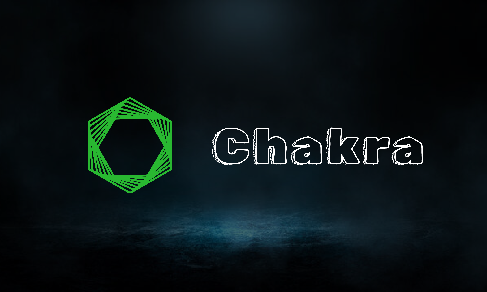

# Chakra

[](https://crates.io/crates/chakra) [](https://crates.io/crates/chakra) [](https://crates.io/crates/chakra) [](https://github.com/anistark/chakra) [](https://github.com/anistark/chakra/graphs/contributors) 



> Chakra is a powerful WebAssembly (WASM) runtime CLI tool with full WASI support and modular plugin architecture.

## ✨ Features

- 🚀 **Instant Development Server** - Point Chakra to your .wasm file or project and get a ready playground in your browser
- 🌐 **Browser Integration** - Automatically opens your default browser with interactive console and debugging tools
- 💻 **Interactive Console** - View execution results and logs in a beautiful web interface
- 🔍 **Smart Detection** - Automatically identifies entry points and module types (standard WASM vs wasm-bindgen)
- 🔌 **Plugin Architecture** - Modular language support through a flexible plugin system
- 📦 **Multi-Language Support** - Built-in plugins for Rust, Go, C/C++, AssemblyScript, and Python
- 🔧 **Built-in Compilation** - Integrated build system with plugin-based compilation
- 🔍 **WASM Inspection** - Verify and analyze WASM files with detailed module information and binary analysis
- 👀 **Live Reload** - Watch mode for automatic recompilation and browser refresh during development
- 🌟 **Full WASI Support** - Complete WebAssembly System Interface implementation with virtual filesystem
- 🌐 **Web Application Support** - Experimental support for Rust web frameworks (Yew, Leptos, Dioxus, etc.)
- ⚡ **Zero Configuration** - Works out of the box with sensible defaults and automatic project detection

## 🚀 Installation

### From Cargo (Recommended)

```sh
cargo install chakra
```

### From Source

```sh
git clone https://github.com/anistark/chakra.git
cd chakra
cargo install --path .
```

## 📖 Usage

Chakra supports both flag-based arguments using `--path` and direct positional arguments for an intuitive command line experience.

### Quick Start

```sh
# Run on current directory
chakra

# Run a WebAssembly file directly  
chakra myfile.wasm

# Run a project directory
chakra ./my-wasm-project

# With flags
chakra --path ./path/to/your/file.wasm
chakra --path ./my-wasm-project
```

### 🔧 Commands

#### Development Server

Start the development server with live reload:

```sh
chakra run ./my-project --watch
chakra run ./my-project --port 3000 --language rust
```

#### Compilation

Compile a project to WebAssembly using the appropriate plugin:

```sh
chakra compile ./my-project
chakra compile ./my-project --output ./build --optimization release
chakra compile ./my-project --optimization size --verbose
```

#### Plugin Management

List available plugins and check dependencies:

```sh
# List all available plugins
chakra plugin list

# Get detailed plugin information
chakra plugin info rust
chakra plugin info go
```

#### Verification & Inspection

Verify a WASM file format and analyze structure:

```sh
chakra verify ./file.wasm
chakra verify ./file.wasm --detailed

chakra inspect ./file.wasm
```

#### Project Management

Initialize a new project:

```sh
chakra init my-app --template rust
chakra init my-app --template go --directory ./projects/
```

Clean build artifacts:

```sh
chakra clean ./my-project
```

#### Server Control

Stop any running Chakra server:

```sh
chakra stop
```

## 🔌 Plugin Architecture

Chakra uses a modular plugin system where each programming language is supported through dedicated plugins. This architecture provides:

- **Extensibility** - Easy to add new language support
- **Maintainability** - Each plugin is self-contained
- **Consistency** - Unified interface across all languages
- **Flexibility** - Plugin-specific optimizations and features

### Built-in Plugins

| Plugin | Status | Compiler/Runtime | Capabilities |
|--------|--------|------------------|--------------|
|  | ✅ Full Support | `cargo` + `rustc` | Standard WASM, wasm-bindgen, web apps, optimization |
|  | ✅ Full Support | `tinygo` | Lightweight runtime, optimization |
|   | ✅ Full Support | `emscripten` | Complete toolchain, Makefile support |
|  | ✅ Full Support | `asc` + npm/yarn | TypeScript-like syntax, optimization |
|  | ✅ Beta Support | `py2wasm` | Runtime integration, bundle creation |

### Plugin Capabilities

Each plugin provides specific capabilities:

| Feature | Rust | Go | C/C++ | AssemblyScript | Python |
|---------|------|----|----|---------------|--------|
| **Compile to WASM** | ✅ | ✅ | ✅ | ✅ | ✅ |
| **Web Applications** | ✅ | ❌ | ✅ | ❌ | ✅ |
| **Live Reload** | ✅ | ✅ | ✅ | ✅ | ❌ |
| **Optimization** | ✅ | ✅ | ✅ | ✅ | ❌ |
| **Custom Targets** | Multiple | wasm | web | wasm | TBD |


### Web Frameworks (Rust Plugin)

The Rust plugin automatically detects and supports web frameworks with specialized web application mode:

- **Yew** - Modern Rust / Wasm framework
- **Leptos** - Full-stack, compile-time optimal Rust framework  
- **Dioxus** - Cross-platform GUI library
- **Sycamore** - Reactive library
- **Trunk** - Build tool for Rust-generated WebAssembly

*Web framework support is highly experimental and actively being improved. Looking for contributors. 👋*

## 🌟 How It Works

### Plugin-Based Compilation

1. **Project Detection** - Chakra analyzes the project and selects the appropriate plugin
2. **Dependency Verification** - The plugin checks for required tools and dependencies
3. **Compilation** - Plugin-specific build process with optimizations
4. **Output Generation** - WASM file creation with plugin-specific features

### For WASM Files

1. Chakra server with WASI support starts running
2. Opens your default browser with an interactive interface
3. Serves the WASM file with comprehensive WASI support including virtual filesystem
4. Provides real-time console output, debugging tools, and file system interaction

### For Projects

1. **Plugin Selection** - Automatically identifies and loads the appropriate language plugin
2. **Dependency Checking** - Plugin verifies required tools are installed
3. **Compilation** - Plugin builds optimized WASM with proper flags and optimizations
4. **Serving** - Runs development server with live reload
5. **Framework Detection** - Special handling for web applications (Rust plugin)

## 🔍 WASI Support

Chakra intends to provide support for complete WebAssembly System Interface (WASI) implementation in the browser. It's a work in progress. Some features might work, but it's highly experimental.

## 🎯 Use Cases

### Development & Testing

```sh
# Quick WASM testing with instant feedback
chakra test.wasm

# Project development with live reload (plugin auto-detected)
chakra run ./my-rust-project --watch

# Build and optimize for production (plugin-specific optimizations)
chakra compile ./my-project --optimization size
```

### Plugin Management

```sh
# List available plugins and their capabilities
chakra plugin list

# Get detailed information about a specific plugin
chakra plugin info rust
```

### Learning & Education

```sh
# Inspect WASM structure and understand internals
chakra inspect ./complex-module.wasm

# Verify WASM compliance and format
chakra verify ./student-submission.wasm --detailed

# See which plugin would handle a project
chakra run ./unknown-project --dry-run
```

### Web Application Development

```sh
# Rust web app with hot reload (Rust plugin auto-detects frameworks)
chakra run ./my-yew-app --watch

# Multi-framework support
chakra run ./leptos-project
chakra run ./dioxus-app

# Python web app with Pyodide
chakra run ./my-python-web-app
```

### Performance Analysis

```sh
# Size-optimized builds with plugin-specific optimizations
chakra compile ./my-project --optimization size

# Debug builds with full symbols
chakra compile ./my-project --optimization debug --verbose

# Compare different plugin optimizations
chakra compile ./rust-project --optimization size
chakra compile ./go-project --optimization size
```

## 🔧 Configuration

### Environment Variables

- `CHAKRA_PORT` - Default server port (default: 8420)
- `CHAKRA_WATCH` - Enable watch mode by default
- `CHAKRA_OUTPUT` - Default output directory for builds
- `CHAKRA_DEBUG` - Enable debug output
- `RUST_BACKTRACE` - Show stack traces for errors

### Plugin Detection

Chakra automatically selects plugins based on project structure:

- **Rust Plugin**: `Cargo.toml` present
- **Go Plugin**: `go.mod` or `.go` files present
- **C/C++ Plugin**: `.c`, `.cpp`, `.h` files, or `Makefile` present
- **AssemblyScript Plugin**: `package.json` with AssemblyScript dependency or `assembly/` directory
- **Python Plugin**: `.py` files or `requirements.txt` present

### Optimization Levels

Plugin-specific optimization levels:

- **`debug`** - Fast compilation, full symbols, no optimization
- **`release`** - Optimized for performance (default)
- **`size`** - Optimized for minimal file size (plugin-dependent implementation)

## 🔍 Troubleshooting

### Plugin-Related Issues

**"No plugin found for project"**
```sh
# Check what files are in your project
ls -la
# Ensure proper entry files exist (Cargo.toml, go.mod, etc.)
# Use chakra plugin list to see available plugins
```
🚨 Open an [issue](https://github.com/anistark/chakra/issues) and let us know about it.

**"Plugin dependencies missing"**
```sh
# Install missing tools for specific plugins:
rustup target add wasm32-unknown-unknown  # Rust plugin
# Install emcc for C/C++ plugin
# Install tinygo for Go plugin  
# Install asc for AssemblyScript plugin
```

**"Wrong plugin selected"**
```sh
# Force a specific plugin
chakra --language rust
chakra --language go
```
### Configuring py2wasm

- Make sure that you have python3.11.0 is installed and configured. We recommend
  using [mise](https://mise.jdx.dev/getting-started.html).
  ```sh
  mise use python@3.11.0
  ```
- Now install py2wasm, you can use a virtual environment or not.
```sh
pip install py2wasm
```
- Make sure that you have named the entry file as main.py or app.py.

### Common Issues

**"Port is already in use"**
```sh
chakra stop  # Stop existing server
chakra --port 3001  # Use different port
```

**"No entry point found"**
- Ensure your WASM has `main()`, `_start()`, or exported functions
- Use `chakra inspect` to see available exports
- Check plugin-specific entry file requirements

**"wasm-bindgen module detected"**
- Use the `.js` file instead of the `.wasm` file directly (Rust plugin)
- Run `chakra project-dir` instead of individual files

## 🤝 Contributing

We welcome contributions! Please see [CONTRIBUTING.md](./CONTRIBUTING.md) for detailed guidelines, including how to add new plugins and extend existing ones.

### Adding New Plugins

The modular architecture makes it easy to add support for new languages. See the [plugin development guide](./CONTRIBUTING.md#adding-new-plugins) for details.

## 📄 License

[MIT License](./LICENSE)

## 🙏 Credits

Chakra is built with love using:

- [tiny_http](https://github.com/tiny-http/tiny-http) - Lightweight HTTP server
- [clap](https://github.com/clap-rs/clap) - Command line argument parsing
- [notify](https://github.com/notify-rs/notify) - File system watching for live reload
- [wasm-bindgen](https://github.com/rustwasm/wasm-bindgen) - Web integration
- And the amazing Rust and WebAssembly communities ❤️

---


**Made with ❤️ for the WebAssembly community**

*⭐ If you find Chakra useful, please consider starring the repository!*
